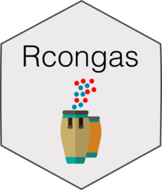

```{r, include = FALSE}
knitr::opts_chunk$set(
  collapse = TRUE,
  comment = "#>",
  fig.path = "man/figures/README-",
  out.width = "100%"
)
```

# Rcongas <a href='militeee.github.io/Rcongas'></a>

<!-- badges: start -->
[](https://travis-ci.org/militeee/Rcongas)
[](https://travis-ci.org/militeee/Rcongas)
[](https://www.tidyverse.org/lifecycle/#maturing)
[](https://caravagn.github.io/evoverse)
<!-- badges: end -->

The package provides an R interface for the Python
[Congas](https://github.com/Militeee/congas) package, which implements
multiple statistical models to genotype Copy Number Alterations from
single-cell RNA sequencing.

The package implements S3 objects to visualize the data, create and
visualise model fits.


`Rcongas` is part of the `evoverse` set of [R
packages](https://caravagnlab.github.io/evoverse) to implement Cancer
Evolution analyses.

#### Citation

[](https://doi.org/10.1101/2021.02.02.429335)

If you use `Rcongas`, please cite:

* _Genotyping Copy Number Alterations from single-cell RNA sequencing._
Salvatore Milite, Riccardo Bergamin, Giulio Caravagna. [biorXiv preprint](https://www.biorxiv.org/content/10.1101/2021.02.02.429335v1), 2021

#### Help and support

[](https://militeee.github.io/Rcongas)

### Installation

You can install the released version of `Rcongas` from
[GitHub](https://github.com/) with:

``` r
# install.packages("devtools")
devtools::install_github("militeee/Rcongas")
```

-----

#### Copyright and contacts

Salvatore Milite, MSc, and Giulio Caravagna, PhD. _University of Trieste, Trieste, Italy_.

[](mailto:gcaravagn@gmail.com)
[](https://github.com/caravagn)
[](https://twitter.com/gcaravagna)
[](https://sites.google.com/site/giuliocaravagna/)

