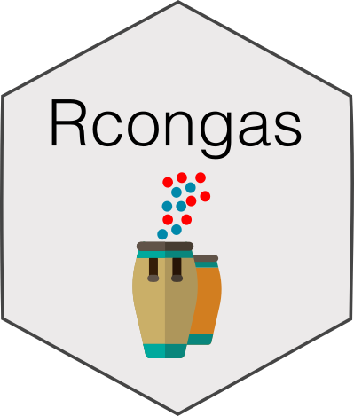

# Rcongas <a href='caravagnalab.github.io/rcongas'></a>

<!-- badges: start -->

[](https://www.tidyverse.org/lifecycle/#maturing)
<!-- badges: end -->

This is the `(R)CONGAS+` R package, an interface to run the
probabilistic methods implemented in the Python
[Congas](https://github.com/Militeee/congas) package using Pyro. These
methods implement several statistical models to genotype Copy Number
Alterations from single-cell RNA and ATAC sequencing, integrating at the
same time bulk DNA sequencing.

This package implements S3 objects to preprocess and visualize input
single-cell data, create and visualize model fits. The current package
is an extension of the original, single-molecule version; it retains the
same name to avoid confusion.

#### Citation

[](https://doi.org/10.1101/2021.02.02.429335)

If you use `Rcongas`, please cite these two papers:

-   *Genotyping Copy Number Alterations from single-cell RNA
    sequencing.* Salvatore Milite, Riccardo Bergamin, Giulio Caravagna.
    [biorXiv
    preprint](https://www.biorxiv.org/content/10.1101/2021.02.02.429335v1),
    2021

-   *Multi-molecule genotyping Copy Number Alterations from single-cell
    sequencing.* Salvatore Milite, Riccardo Bergamin, Lucrezia Patruno,
    Alex Graudenzi, Giulio Caravagna.

#### Help and support

[](https://caravagnalab.github.io/rcongas)

### Installation

You can install the released version of `Rcongas` from
[GitHub](https://github.com/) with:

``` r
# install.packages("devtools")
devtools::install_github("caravagnalab/Rcongas")
```

------------------------------------------------------------------------

#### Copyright and contacts

Salvatore Milite, MSc, Riccardo Bergamin, PhD, and Giulio Caravagna,
PhD. *University of Trieste, Trieste, Italy*.

[](mailto:gcaravagn@gmail.com)
[](https://github.com/caravagnalab)
[](https://www.caravagnalab.org/)
